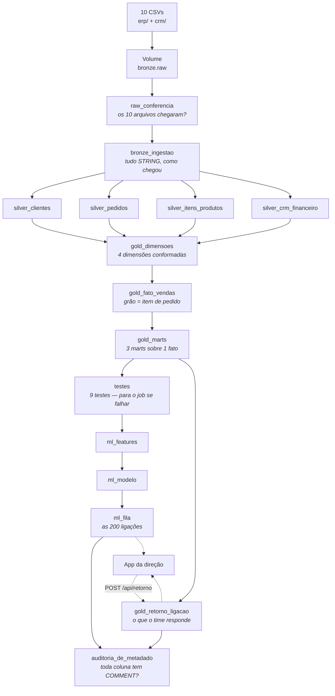

# Lakehouse Rota Perfume

Um lakehouse completo no Databricks, construído a partir de **dez arquivos CSV**,
para uma distribuidora de perfumes fictícia. Sai de arquivo bruto e chega em
três coisas que alguém usa de verdade: um **dashboard**, um **modelo** que
escolhe as 200 ligações da semana, e um **app** onde o time registra o que
aconteceu depois da ligação — fechando o ciclo de volta para o dado.

Tudo é código. O catálogo, os schemas, o pipeline, os testes, o dashboard, os
agentes Genie e o app: nada foi criado clicando na interface, e tudo pode ser
destruído e reconstruído do zero com os comandos deste README.

> **Contexto.** Este é um projeto de estudo, construído ao longo de quatro noites
> de um curso de engenharia de dados, conversando com um agente de IA. Os
> enunciados de cada entrega estão em [`prompts/`](prompts/) — veja
> [Créditos](#créditos).

---

## Índice

- [O que fica de pé no final](#o-que-fica-de-pé-no-final)
- [A arquitetura](#a-arquitetura)
- [Pré-requisitos](#pré-requisitos)
- [Setup — primeira vez](#setup--primeira-vez)
- [Rodar o pipeline](#rodar-o-pipeline)
- [Subir o app](#subir-o-app)
- [As quatro noites](#as-quatro-noites)
- [Os números que têm que bater](#os-números-que-têm-que-bater)
- [Estrutura do repositório](#estrutura-do-repositório)
- [Armadilhas que custaram caro](#armadilhas-que-custaram-caro)
- [Reusar em outro projeto](#reusar-em-outro-projeto)
- [Desfazer](#desfazer)
- [Créditos](#créditos)

---

## O que fica de pé no final

| Entrega | O que é |
|---|---|
| **Catálogo `lakehouse_rotaperfume`** | Schemas `bronze` / `silver` / `gold` e um Volume, declarados no bundle |
| **Job `rotaperfume_pipeline`** | 15 tarefas, serverless, diário às 06:00 (`America/Sao_Paulo`) |
| **37 tabelas** | 12 bronze (10 de dado + 2 de controle), 10 silver, 15 gold |
| **9 testes de qualidade** | Tarefa obrigatória que **interrompe o job** quando um número não bate |
| **Dashboard AI/BI** | 14 widgets, deployado pelo bundle — não clicado |
| **Modelo de propensão** | Registrado no Unity Catalog com alias `@prod`, AUC 0,88 |
| **Fila semanal** | As 200 ligações de maior chance, com motivo em português |
| **Dois agentes Genie** | Um para o vendedor, um para a direção — audiências diferentes |
| **Databricks App** | Três telas, e a única rota de escrita do projeto |

---

## A arquitetura

O dado entra uma vez, pela esquerda, e nunca volta atrás. Cada camada tem uma
regra que a define, e as tarefas em paralelo estão no mesmo nível:



A seta pontilhada de volta é o ponto do projeto inteiro: o pipeline produz uma
lista, alguém liga, e **o resultado da ligação volta para dentro do lakehouse**
— virando o dado de treino da semana seguinte.

**A doutrina das camadas**, que o código obriga:

- **raw é arquivo.** Nada de tabela; só a conferência de que os 10 chegaram.
- **bronze é a tabela como o dado chegou.** Toda coluna `STRING`. O CNPJ mantém
  os espaços em volta, `ativo` continua `S`/`N`, data vazia continua vazia. Não
  "conserte" a bronze.
- **silver limpa mas nunca descarta.** Devoluções, cancelamentos, SKUs
  descontinuados e carteiras órfãs **ficam**, marcados numa coluna. Problema de
  negócio se expõe, não se corrige em silêncio.
- **gold lê só a silver.** Nunca a bronze.

---

## Pré-requisitos

| | Versão | Conferir |
|---|---|---|
| Databricks CLI | ≥ 0.292 | `databricks --version` |
| Um workspace | Free Edition serve | — |
| Python + [uv](https://docs.astral.sh/uv/) | 3.11+ | `uv --version` |
| Node.js | 20+ (só para o app) | `node --version` |
| PowerShell | os scripts são `.ps1` | — |

Tudo aqui é **serverless**. Não configure cluster.

---

## Setup — primeira vez

### 1. Autenticar

```powershell
databricks auth login --host https://SEU-WORKSPACE.cloud.databricks.com --profile meu-perfil
databricks auth profiles                      # confira que aparece e está válido
```

O nome do perfil é escolha sua. **Todo comando abaixo passa `--profile`
explicitamente** — é isso que mantém o endereço do seu workspace fora do
repositório, e o que evita deployar no workspace errado.

### 2. Preencher as variáveis locais

O `databricks.yml` não guarda e-mail nem id de warehouse. Eles são variáveis sem
valor padrão, preenchidas num arquivo que o `.gitignore` exclui:

```powershell
cd rotaperfumes
.\scripts\configurar.ps1                      # cria os arquivos a partir do modelo
```

Descubra os valores e edite os dois arquivos que o script criou:

```powershell
databricks current-user me --profile meu-perfil     # -> workspace_user
databricks warehouses list --profile meu-perfil     # -> warehouse_id
```

Se esquecer esta etapa, o `bundle validate` falha dizendo qual variável está sem
valor. Falha barulhenta é de propósito: um valor padrão aqui seria o e-mail de
outra pessoa.

### 3. Criar o catálogo, deployar, subir os dados

**A ordem importa duas vezes**, e nas duas o erro é silencioso ou confuso:

```powershell
.\scripts\criar-catalogo.ps1 meu-perfil                                   # 1
databricks bundle validate --strict --target dev --profile meu-perfil     # 2
databricks bundle deploy --target dev --profile meu-perfil                # 3
.\scripts\subir-raw.ps1 meu-perfil                                        # 4
```

1. **O catálogo primeiro**, e por SQL, não pelo bundle. No Free Edition com
   Default Storage a API do Unity Catalog recusa `CREATE CATALOG` por falta de
   MANAGED LOCATION (`400 INVALID_STATE`). O script contorna via SQL.
2. `--strict` transforma aviso em erro. Use sempre.
3. O deploy cria os schemas — e precisa do catálogo já existindo.
4. O upload precisa do **Volume** já existindo, que o passo 3 criou.

---

## Rodar o pipeline

```powershell
databricks bundle run rotaperfume_pipeline --target dev --profile meu-perfil
```

Um job novo em máquina fria leva alguns minutos; quente, cerca de 2min30 para as
primeiras tarefas. **Acorde o warehouse antes de uma demonstração.**

<details>
<summary><strong>Quanto demora cada tarefa</strong> — execução completa, 15 de 15 verdes, <strong>9min35</strong></summary>

| # | tarefa | duração |
|---|---|---|
| 1 | `raw_conferencia` | 23s |
| 2 | `bronze_ingestao` | 63s |
| 3 | `silver_clientes` | 23s |
| 4 | `silver_pedidos` | 21s |
| 5 | `silver_itens_produtos` | 32s |
| 6 | `silver_crm_financeiro` | 49s |
| 7 | `gold_dimensoes` | 56s |
| 8 | `gold_fato_vendas` | 32s |
| 9 | `gold_marts` | 52s |
| 10 | `gold_retorno_ligacao` | 2s |
| 11 | `testes` | 10s |
| 12 | `ml_features` | 87s |
| 13 | `ml_modelo` | **146s** |
| 14 | `ml_fila` | 30s |
| 15 | `auditoria_de_metadado` | 2s |

Três coisas que esses números contam:

- **A soma das 15 tarefas é 10min28, e o relógio marcou 9min35.** A diferença é
  paralelismo: as quatro `silver_*` rodam juntas e custam o tempo da mais lenta
  (49s), não a soma (125s). As de gold são encadeadas de propósito.
- **O caminho crítico é 9min10** (`raw` → `bronze` → `silver_crm_financeiro` →
  `gold_dimensoes` → `gold_fato_vendas` → `gold_marts` → `testes` →
  `ml_features` → `ml_modelo` → `ml_fila` → `auditoria`). Sobram ~25s de
  orquestração e cold start — pouco, porque o job já estava quente. **Frio, é
  essa folga que vira minutos**, e é ela que aparece numa demonstração.
- **`ml_modelo` sozinho é um quarto do tempo.** Ele treina três candidatos, e as
  duas calibragens são cinco fits internos cada, mais a validação cruzada do
  `lift_top200`. É o preço de escolher a calibragem por medida em vez de por
  opinião — e, no lugar certo, vale: foi o que tirou 30% de otimismo da receita
  esperada.

</details>

Para rodar **uma tarefa só** — útil quando você mexeu num `.sql` e não quer
pagar o DAG inteiro, ou para ver um teste falhar de propósito:

```powershell
.\scripts\rodar-tarefa.ps1 meu-perfil bronze_ingestao
```

O script descobre o `job_id` pelo `bundle summary` do target, então acerta
sempre o job do ambiente em que você está — nunca um id copiado de outro
workspace. Repare que a tarefa roda **isolada**: as dependências não rodam, são
assumidas como já materializadas.

---

## Subir o app

O app **não faz parte do `bundle deploy`** do lakehouse. Tem ciclo próprio, e o
target dele é `default`, nunca `dev`.

```powershell
cd rotaperfume-direcao
npm install
npm run configurar                            # cria o arquivo de variáveis local
# preencha sql_warehouse_id e genie_space_id em
# .databricks\bundle\default\variable-overrides.json
npm run typegen -- --wait                     # tipos das consultas, do warehouse
databricks apps deploy -t default --profile meu-perfil
```

> **Nunca rode `bundle deploy` neste diretório.** Ele cria o app parado, com
> `no_compute` e sem URL.

O service principal do app precisa de três permissões, senão as telas carregam
**vazias, sem erro nenhum**:

```sql
GRANT USE CATALOG ON CATALOG lakehouse_rotaperfume TO `<client_id_do_app>`;
GRANT USE SCHEMA, SELECT ON SCHEMA lakehouse_rotaperfume.gold TO `<client_id_do_app>`;
GRANT MODIFY ON TABLE lakehouse_rotaperfume.gold.retorno_ligacao TO `<client_id_do_app>`;
```

O client id sai de `databricks apps get rotaperfume-direcao -o json --profile meu-perfil`
(campo `service_principal_client_id`) e é **novo a cada app criado** — nunca
copie entre ambientes. E repare que o `MODIFY` é **numa tabela só**: no schema,
deixaria o app reescrever `fato_vendas`.

Se o app aparecer parado (`STOPPED`), é o Free Edition derrubando compute ocioso:

```powershell
databricks apps start rotaperfume-direcao --profile meu-perfil
```

---

## As quatro noites

Os enunciados completos estão em [`prompts/`](prompts/README.md).

### Noite 2 — de arquivo a lakehouse testado

Cinco entregas, cinco deploys. O catálogo vira código; os CSVs viram tabelas
bronze com a contagem conferida; a silver limpa sob contrato (`ALTER TABLE …
ADD CONSTRAINT`, que pertence à tabela, não ao script); a gold monta quatro
dimensões conformadas, um fato no grão de item de pedido e três marts; e nove
testes fecham o job. No fim, um dashboard AI/BI de 14 widgets deployado pelo
bundle.

> **Por que a noite 1 não está aqui:** foi a noite de fazer tudo clicando na
> interface, em outro repositório, justamente para haver contra o que comparar.

### Noite 3 — o modelo entra no mesmo pipeline

A pergunta é *"quais 200 clientes ligar?"*. Uma função `montar_features` constrói
20 features por cliente usando **só dados anteriores a uma data de corte**
recebida por parâmetro, e é chamada duas vezes — treino e escore. Uma função só
para os dois é o que torna o *training/serving skew* impossível.

O modelo (`HistGradientBoostingClassifier`) é registrado no Unity Catalog com
alias `@prod`. Três `assert` param a tarefa, incluindo `auc < 0.99` — porque
vazamento de dado chega como elogio, não como erro.

**Por que uma árvore e não um `ORDER BY`:** a taxa de compra por faixa de atraso
relativo é 0,5% → 17,6% → **36,6%** → 14,4% → **0%**. O pico está no meio, então
ordenar a coluna decrescente coloca o grupo de 0% em primeiro lugar: AUC 0,78 e
**1** acerto no top 200. Nenhuma ordenação por uma coluna resolve isso.

### Noite 4 — Genie, app, e o caminho de volta

Três noites construíram o caminho de ida — arquivo → modelo → 200 ligações — e o
pipeline nunca soube o que aconteceu depois. A noite 4 fecha o ciclo:

- `gold.retorno_ligacao`, a única tabela do projeto alimentada pelo **time** e não
  pelo pipeline — e por isso a única `CREATE TABLE IF NOT EXISTS`. Ela nasce
  **vazia**, e vazio é o estado correto.
- Um **segundo** Genie space, para a direção. Mesmo dado, mesmo modelo; o que muda
  é a audiência, e a audiência mora em ~20 linhas de instrução sob Git.
- O **app**: três telas e uma rota `POST /api/retorno` cujo conjunto de valores é
  fechado por um enum no servidor. O botão é interface; o enum é o contrato, e é
  o que impede a coluna de colecionar "vendeu", "Vendeu" e "vendido".
- Uma tarefa de **auditoria de metadado**, última do DAG, que derruba o job se
  qualquer tabela ou coluna da gold estiver sem `COMMENT`.

---

## Os números que têm que bater

São critérios de aceite, não curiosidades: se um deles muda, alguma coisa
quebrou.

| Número | Onde | Significa |
|---|---|---|
| **313.551** | linhas nos 10 CSVs | tudo que entrou |
| **R$ 102.303.828,05** | bronze = silver = gold | **a receita não pode se mover entre camadas** |
| **191.080** | linhas em `fato_vendas` | contra 197.724 itens na silver — a diferença são os 6.644 itens dos 957 pedidos cancelados |
| **≈ 6,9** | `COUNT(*) / COUNT(DISTINCT pedido_id)` | se ler ≈13,8, um join duplicou linhas |
| **10,12%** | taxa base | quanto da base compra em 7 dias sem ninguém ligar |
| **0,8853** | AUC do modelo | |
| **0,0705** | Brier do modelo | contra **0,0775** sem calibrar — é a métrica que enxerga calibragem, e AUC não |
| **4,44×** | lift no top 200 | **90** dos 200 compraram, contra 20 ao acaso |
| **36** | vendedores na fila | por `vendedor_id`; por nome dá 35, e some uma pessoa |

Duas armadilhas escondidas nesses números:

- **As devoluções ficam dentro do fato**, com quantidade e receita negativas mais
  uma flag. Excluí-las faz a gold somar 103.568.586,35 contra 102.303.828,05 da
  silver — 1,26 milhão de diferença entre duas camadas do mesmo pipeline.
- **A reconciliação da bronze tem limite conhecido.** Ela compara o Volume com a
  bronze *dentro da mesma execução*: pega linha perdida na leitura, não arquivo
  que chegou truncado. Truncar `pagamentos.csv` para 100 linhas e rodar o job
  termina **verde**, com o total caindo em silêncio para 285.879. Pegar isso
  exige uma linha de base entre execuções — ainda não construída.

---

## Estrutura do repositório

```
├── dados/                      os 10 CSVs de origem (15 MB), por sistema
│   ├── erp/                    produtos, pedidos, itens_pedido, pagamentos, estoque
│   └── crm/                    clientes, vendedores, carteira, oportunidades, visitas
├── prompts/                    os enunciados, por noite  → prompts/README.md
├── rotaperfumes/               o bundle (DAB) do lakehouse
│   ├── resources/              catálogo, job, dashboard, Genie — como YAML
│   ├── src/raw|bronze|silver|gold|ml/
│   └── scripts/                PowerShell: configurar, criar catálogo, subir dados
└── rotaperfume-direcao/        o Databricks App (AppKit: Node/TypeScript/React)
    ├── config/queries/         toda leitura é um .sql tipado
    ├── client/src/pages/       A semana · Perguntar · Acompanhamento
    └── server/server.ts        a única rota de escrita
```

Os CSVs são o substituto local das exportações do ERP/CRM: eles são **enviados
para um Volume** do Unity Catalog, e nenhuma tarefa lê do disco.

---

## Armadilhas que custaram caro

As que mais custaram tempo, com o motivo — que é a parte que se leva para o
próximo projeto:

**Plataforma**

- **DBSQL roda em modo ANSI: use `try_to_date`, nunca `to_date`.** Uma data
  malformada **aborta a query** com `CAST_INVALID_INPUT` em vez de devolver NULL.
  Como a origem mistura dois formatos na mesma coluna, toda conversão é
  `coalesce(try_to_date(x), try_to_date(x, 'dd/MM/yyyy'))`.
- **`raise_error()` tem tipo `NOTHING`** e não pode ficar sozinha num SELECT. Ela
  vive dentro de `CASE WHEN <bom> THEN 'PASSOU' ELSE raise_error(…) END`.
- **Não use `mode: development` num target que declara schemas do UC.** Ele
  prefixa todo recurso com `[dev usuário]` — inclusive os schemas, que viram
  `dev_fulano_bronze` e quebram cada referência SQL escrita à mão.
- **Variável não resolve em `workspace.host`.** É configuração de autenticação e
  é lida antes das variáveis do bundle: `${var.x}` ali falha com
  `invalid character "{" in host name`. Por isso o host vem do `--profile`.

**Dado**

- **Nunca converta CNPJ para número** — 309 clientes têm zero à esquerda que um
  tipo numérico come em silêncio. Fica `STRING`.
- **Ids na bronze são STRING, então compare com `CAST`.** `WHERE vendedor_id > '40'`
  é comparação de texto e casa com `'5'`.
- **Nome de vendedor não é único.** Dois `Henrique Oliveira`, dois `Vinícius
  Lopes`. Agrupar por nome funde a fila de duas pessoas sem avisar.
- **`F.least()` ignora NULL** — `least(NULL, 10)` devolve `10`. Usar isso para
  limitar uma razão deu a 105 clientes o valor máximo de alarme e jogou todos
  para o topo da fila.

**Modelo**

- **Nunca construa feature a partir de `gold.dim_cliente`.** Suas colunas são
  agregadas sobre a base inteira, sem corte temporal: usar qualquer uma é
  vazamento. Recência negativa é a assinatura de uma origem que escapou do filtro.
- **O "hoje" do dataset é 2026-08-31**, o máximo de `data_pedido`. `current_date()`
  em código de ML não tem relação nenhuma com o dia que o dado conhece.

**Quando um teste falha, conserte a transformação — nunca o teste.** A tarefa de
testes é a última e é obrigatória: quando ela fica vermelha, nada rodou depois e
o dashboard mantém o dado de ontem — que é melhor do que o dado errado de hoje.

---

## Reusar em outro projeto

Três coisas deste repositório são reaproveitáveis inteiras:

1. **A forma dos prompts** — entrega, contexto, critério numérico, armadilha com
   o motivo. Está explicada em
   [prompts/README.md](prompts/README.md#reusar-em-outro-projeto).
2. **O padrão de configuração** — nenhum dado de workspace no YAML; variáveis sem
   valor padrão preenchidas num arquivo ignorado pelo Git; host vindo do
   `--profile`. Copie `variable-overrides.exemplo.json` e `scripts/configurar.ps1`.
3. **As armadilhas de plataforma** da seção acima — valem em qualquer projeto
   Databricks, independentemente do domínio.

O que **não** se leva é o domínio: nomes de tabela, as regras de negócio e os
números do critério de aceite são deste projeto.

---

## Desfazer

Cada noite tem um script que a desfaz sem derrubar as anteriores — é o que
permite refazer uma noite do zero quantas vezes quiser. Sem `--apagar`, eles só
**mostram** o que fariam:

```bash
bash prompts/noite-3-machine-learning/99-limpar.sh meu-perfil            # simula
bash prompts/noite-3-machine-learning/99-limpar.sh meu-perfil --apagar   # apaga
bash prompts/noite-4-genie-e-app/99-limpar.sh meu-perfil --apagar
bash prompts/noite-4-genie-e-app/99-limpar-retornos.sh meu-perfil --apagar
```

O último apaga só as linhas de teste de `gold.retorno_ligacao`, deixando a tabela
de pé e vazia — que é o estado inicial correto dela.

---

## Créditos

Projeto de estudo, construído ao longo de quatro noites de um curso de engenharia
de dados, com apoio de um agente de IA. Os dados são **fictícios** e gerados para
o curso; "Rota Perfume" é uma distribuidora que não existe.

Os enunciados originais de cada entrega estão preservados em
[`prompts/`](prompts/README.md), com a identidade de workspace removida e
substituída por marcadores.
